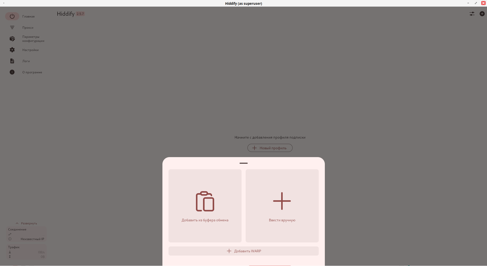
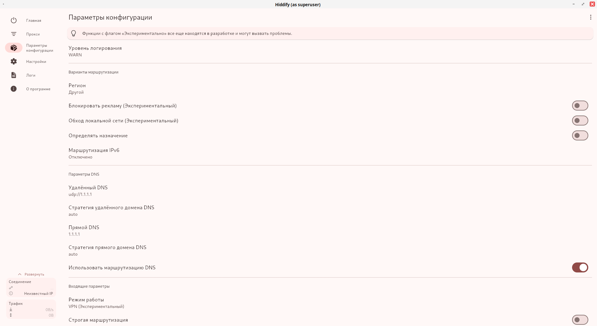
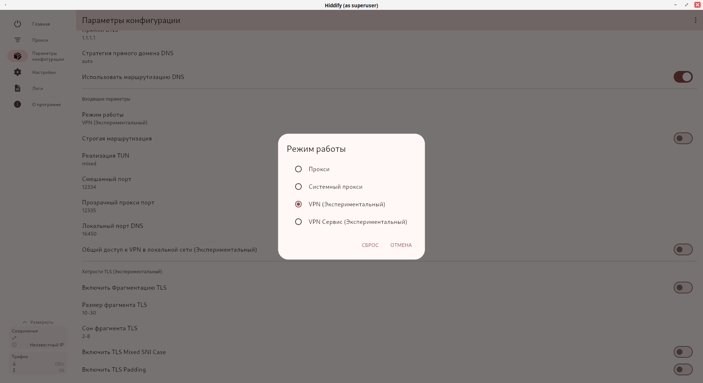
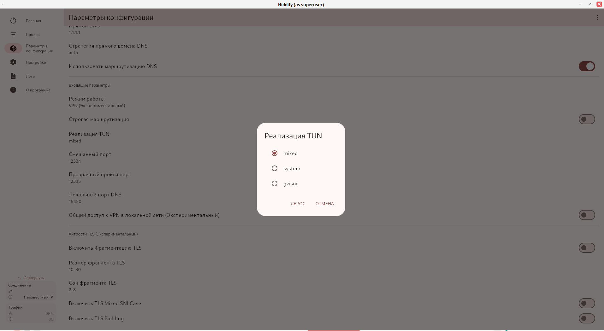

# Hiddify Client Installer

Автоматический установщик клиента Hiddify для Windows и Linux систем.

## Быстрая установка (Linux)

```bash
curl -fsSL https://raw.githubusercontent.com/Tinkerbells/hiddify-install/main/install.sh | bash
```

## Что устанавливается

- **Hiddify AppImage** - основное приложение клиента
- **hiddify-run** - скрипт запуска в `/usr/bin/`
- **hiddify.desktop** - файл для меню приложений
- **hiddify.png** - иконка приложения

## Windows

### Установка для Windows

1. Скачайте установщик: [Hiddify-Windows-Setup-x64.exe](https://github.com/hiddify/hiddify-app/releases/download/v2.3.1/Hiddify-Windows-Setup-x64.exe)
2. Следуйте инструкциям установщика
3. Запустите приложение **от имени администратора**

## Linux

### Требования

- Linux система с поддержкой AppImage
- `wget` или `curl` для загрузки файлов
- `sudo` права для установки в систему

## Ручная установка

1. Клонируйте репозиторий:

```bash
git clone <repository-url>
cd hiddify
```

2. Запустите установщик:

```bash
./install.sh
```

## Запуск приложения

После установки приложение можно запустить:

- Из меню приложений (найти "Hiddify")
- Командой в терминале: `hiddify-run`

## Удаление

Для удаления выполните:

```bash
sudo rm -f /usr/bin/hiddify /usr/bin/hiddify-run
rm -f ~/.local/share/applications/hiddify.desktop
sudo rm -f /usr/share/icons/hicolor/128x128/apps/hiddify.png
```

## Устранение неполадок

### Ошибка "wget или curl не найден"

Установите один из инструментов:

```bash
# Ubuntu/Debian
sudo apt-get install wget

# CentOS/RHEL
sudo yum install wget

# Fedora
sudo dnf install wget
```

### AppImage не запускается

Убедитесь, что система поддерживает FUSE:

```bash
# Ubuntu/Debian
sudo apt-get install fuse

# CentOS/RHEL
sudo yum install fuse
```

## Настройка клиента Hiddify

После установки и запуска Hiddify, необходимо настроить подключение:

### 1. Добавление профиля подписки



На главном экране нажмите кнопку **"Новый профиль"** для добавления конфигурации VPN.

### 2. Настройка основных параметров



В разделе **"Параметры конфигурации"** настройте:
- **Уровень логирования**: оставьте WARN по умолчанию
- **Регион**: выберите "Другой"
- **Удалённый DNS**: установите udp://1.1.1.1
- **Использовать маршрутизацию DNS**: включите для лучшей производительности

### 3. Выбор режима работы



В настройках **"Режим работы"** выберите:
- **VPN (Экспериментальный)** - для полного туннелирования трафика
- Другие режимы доступны в зависимости от ваших потребностей

### 4. Настройка реализации TUN



В параметре **"Реализация TUN"** выберите:
- **mixed** - рекомендуемый режим для большинства систем
- **system** или **gvisor** - альтернативные варианты при проблемах с mixed

После настройки всех параметров сохраните конфигурацию и активируйте VPN-подключение.

## Структура файлов

```
.
├── install.sh          # Основной установщик
├── hiddify-run         # Скрипт запуска
├── hiddify.desktop     # Desktop файл
├── hiddify.png         # Иконка приложения
├── screenshots/        # Скриншоты для настройки
└── README.md           # Документация
```
